# Manual de usuario

Sistema de Gestión de Incidencias · Departamento de Ciencias Básicas · TESCHI

> Las imágenes de este manual usan datos ficticios de demostración.

## Contenido

1. [Roles del sistema](#1-roles-del-sistema)
2. [Acceso al sistema](#2-acceso-al-sistema)
3. [Pantalla principal](#3-pantalla-principal)
4. [Registrar una incidencia](#4-registrar-una-incidencia)
5. [Consultar mis incidencias](#5-consultar-mis-incidencias)
6. [Detalle y seguimiento](#6-detalle-y-seguimiento)
7. [Ticket en PDF](#7-ticket-en-pdf)
8. [Atender incidencias asignadas](#8-atender-incidencias-asignadas)
9. [Gestionar incidencias (Coordinador y Administrador)](#9-gestionar-incidencias-coordinador-y-administrador)
10. [Reportes](#10-reportes)
11. [Notificaciones](#11-notificaciones)
12. [Mi perfil](#12-mi-perfil)
13. [Administración de usuarios](#13-administración-de-usuarios)
14. [Catálogos](#14-catálogos)
15. [Estados de una incidencia](#15-estados-de-una-incidencia)

---

## 1. Roles del sistema

| Rol | Qué puede hacer |
|---|---|
| **Estudiante** | Registrar incidencias, consultar las suyas, comentar, adjuntar evidencias, cancelarlas mientras estén *Pendientes* y descargar su ticket. |
| **Docente** / **Administrativo** | Todo lo anterior y, además, **atender** las incidencias que le asignen (*Asignadas a mí*). |
| **Coordinador** | Todo lo anterior y, además, ver **todas** las incidencias, asignar responsables, cambiar estados, reclasificar y consultar **Reportes**. |
| **Administrador** | Todo lo anterior y, además, administrar **Usuarios**, **Catálogos** y restablecer contraseñas. |

El menú superior solo muestra las opciones de tu rol.

## 2. Acceso al sistema

### 2.1 Iniciar sesión

Escribe tu correo institucional y tu contraseña. Si los datos no coinciden verás
*"Correo o contraseña incorrectos"*.

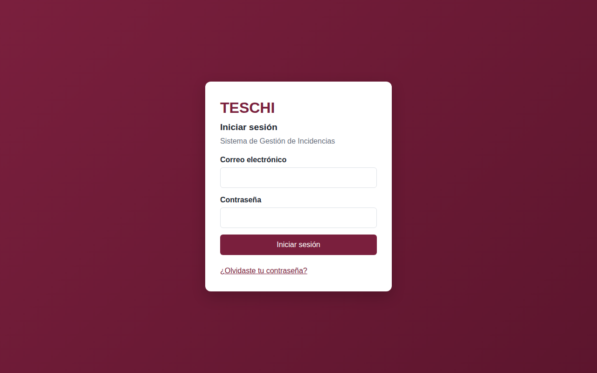

### 2.2 ¿Olvidaste tu contraseña?

1. En el inicio de sesión pulsa **¿Olvidaste tu contraseña?** y escribe tu correo.
2. Según cómo esté configurado el sistema:
   - **Con correo:** recibirás un enlace válido por **60 minutos**.
   - **Sin correo:** el Administrador recibe un aviso y te hará llegar un enlace válido por **24 horas**.
3. Abre el enlace y escribe tu nueva contraseña (mínimo 8 caracteres).

Cada enlace funciona **una sola vez**. Por seguridad, el mensaje es el mismo aunque el correo no esté registrado,
y solo se permiten 3 solicitudes por hora.

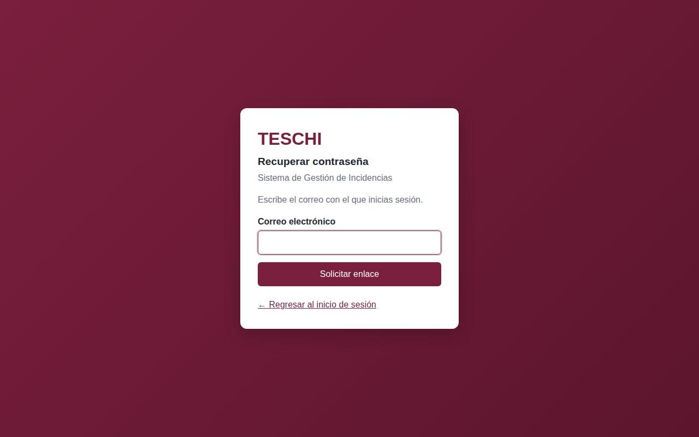

## 3. Pantalla principal

El **Dashboard** muestra un resumen de incidencias por estado (las tuyas o, para Coordinador y Administrador,
las de todo el departamento) y accesos directos a los módulos.

En la barra superior están la **campana de notificaciones** (con el número de avisos sin leer), tu nombre, tu rol
y **Cerrar sesión**.

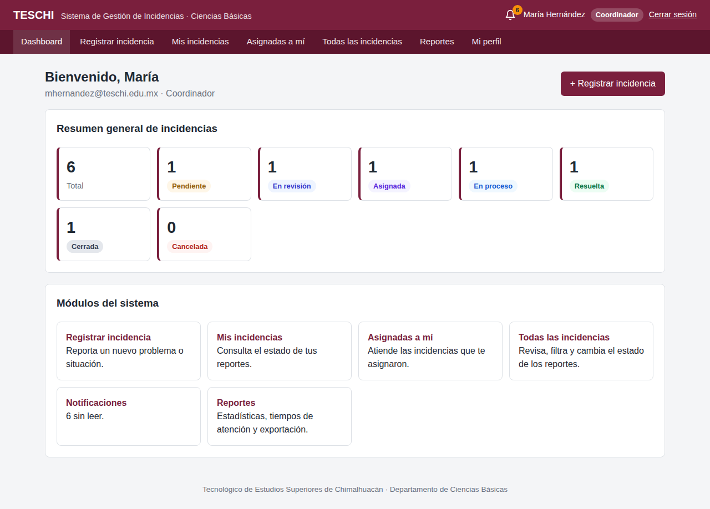

## 4. Registrar una incidencia

Menú **Registrar incidencia**.

| Campo | Obligatorio | Descripción |
|---|:---:|---|
| Título | ✔ | Resumen corto del problema o solicitud (aparece como "Solicitud" en el ticket). |
| Categoría | ✔ | Académica, Control Escolar, Equipo de cómputo, Redes, etc. |
| Prioridad | ✔ | Baja, Media, Alta o Crítica. Define el **tiempo estimado de atención**. |
| Carrera | | Se elige de la lista oficial de carreras (o "No aplica"). Se propone la de tu perfil. |
| Teléfono de contacto | | Se propone el de tu perfil. |
| Ubicación | | Aula, laboratorio, edificio… |
| Descripción | ✔ | Explica el problema con detalle. Puedes escribir listas (por ejemplo, alumnos y matrículas). |
| Evidencias | | Hasta 5 archivos JPG, PNG, WEBP o PDF de máximo 5 MB cada uno. |

Al guardar, la incidencia queda **Pendiente**, recibe un **folio** (por ejemplo `INC-20260923-4F2A9C`) y los
Coordinadores reciben un aviso.

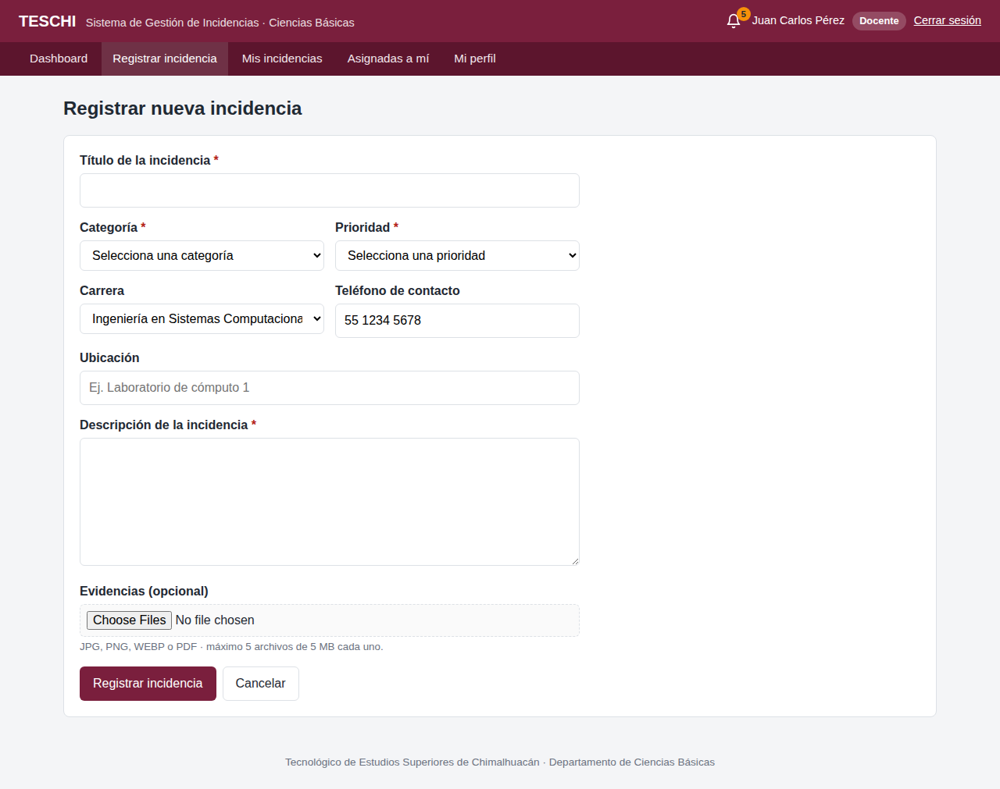

> El botón para adjuntar archivos aparece con el texto del idioma de tu navegador
> (por ejemplo, "Seleccionar archivos").

## 5. Consultar mis incidencias

Menú **Mis incidencias**: lista de tus reportes con folio, categoría, prioridad, estado y fecha. Desde cada fila puedes
abrir el **detalle** o el **ticket** en PDF. Las listas largas se dividen en páginas (10, 20, 50 o 100 por página).

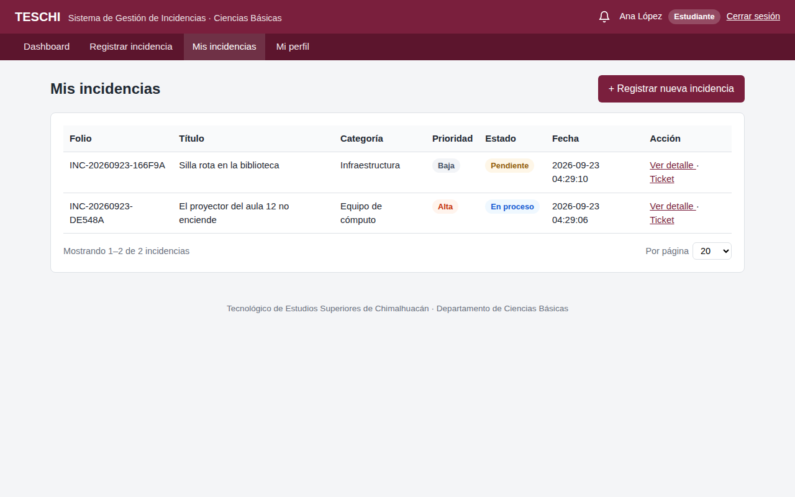

## 6. Detalle y seguimiento

Al abrir una incidencia verás:

- **Datos**: quién la reportó, número de empleado o matrícula, carrera, teléfono, categoría, prioridad, ubicación,
  responsable, fechas y **tiempo estimado de atención** (en días hábiles, con fecha límite).
- **Evidencias** adjuntas al registrarla.
- **Seguimiento**: línea de tiempo con cada cambio de estado, asignación, reclasificación y comentario,
  con quién lo hizo y cuándo.
- **Agregar comentario**: texto, archivos o ambos. Las incidencias *Cerradas* o *Canceladas* ya no admiten comentarios.
- **Cancelar incidencia**: solo quien la reportó y solo mientras esté *Pendiente*.

Al abrir una incidencia, sus notificaciones se marcan como leídas.

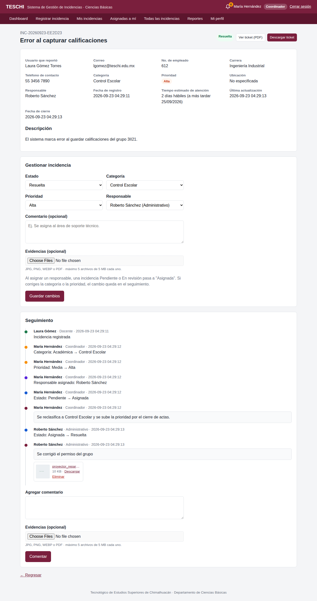

### Eliminar una evidencia

Quien subió el archivo puede eliminarlo mientras la incidencia admita comentarios; el Coordinador y el Administrador
pueden hacerlo siempre. La eliminación queda registrada en el seguimiento.

## 7. Ticket en PDF

En el detalle de la incidencia están los botones **Ver ticket (PDF)** y **Descargar ticket**. El ticket contiene:

- Encabezado de la institución, **No. de ticket**, folio, fecha y hora.
- Nombre del docente o solicitante, carrera, No. de empleado o matrícula, teléfono y correo.
- Solicitud, categoría, prioridad, ubicación y descripción breve.
- **Tiempo estimado de atención** y fecha límite.
- Estado, responsable, evidencias y fecha de cierre al momento de imprimir.
- Leyenda *"Conserve este ticket para garantía"*, firmas del Departamento y de la persona atendida,
  espacio para el sello y *"Gracias por su visita"*.

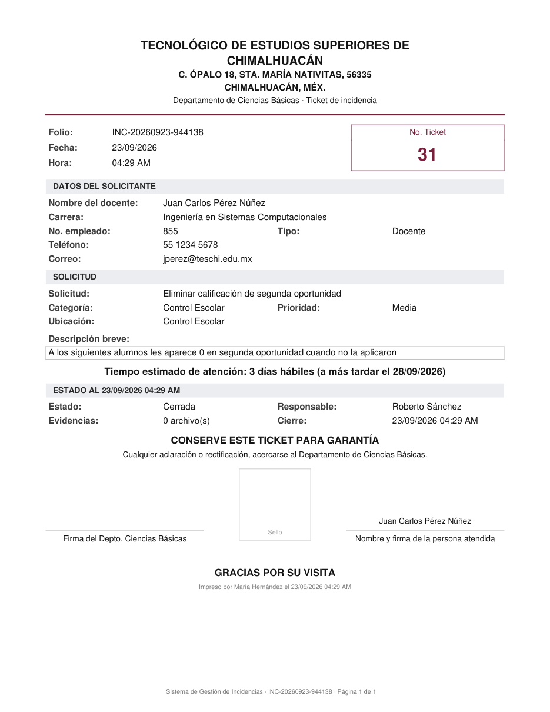

## 8. Atender incidencias asignadas

*(Docente, Administrativo, Coordinador y Administrador)*

Menú **Asignadas a mí**: las incidencias en las que eres responsable, ordenadas por prioridad y antigüedad.
Por defecto se ocultan las terminadas; usa **Incluir terminadas** para verlas.

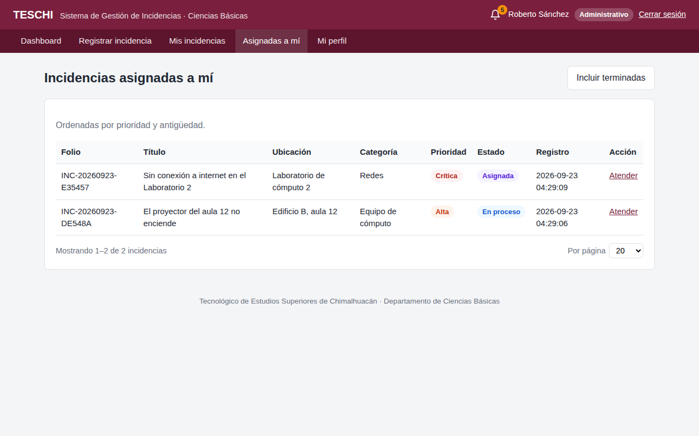

En el detalle aparece el recuadro **Atender incidencia**:

1. Cambia el estado a **En proceso** cuando empieces a trabajar.
2. Cámbialo a **Resuelta** cuando termines. Es obligatorio **describir la solución** en el comentario.
3. Puedes adjuntar evidencias (por ejemplo, una foto del equipo reparado).

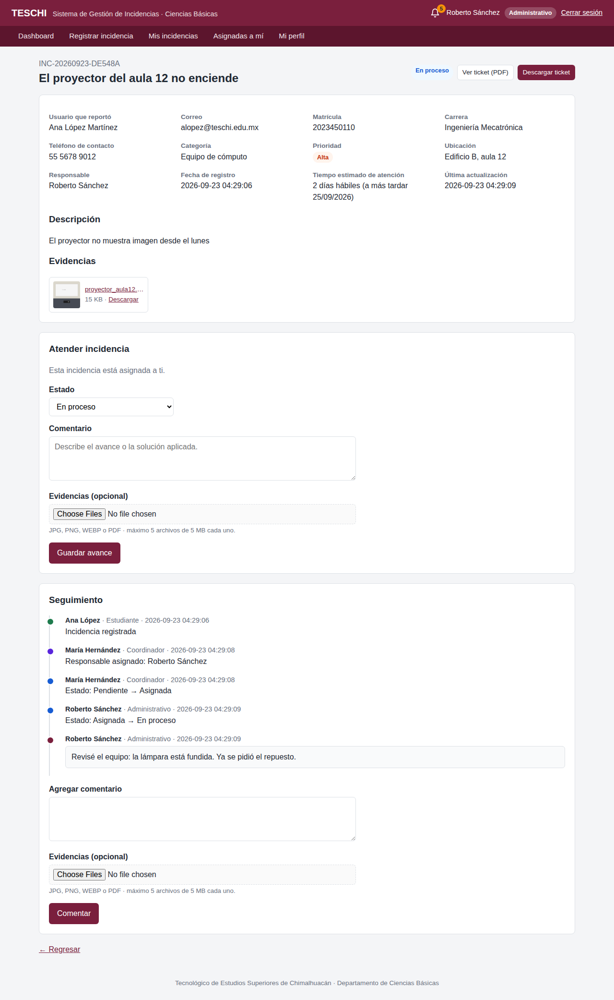

## 9. Gestionar incidencias (Coordinador y Administrador)

### 9.1 Todas las incidencias

Lista completa con filtros por **estado, categoría, prioridad, responsable** (incluye "Sin asignar") y búsqueda por
folio o título. Los filtros se conservan al cambiar de página.

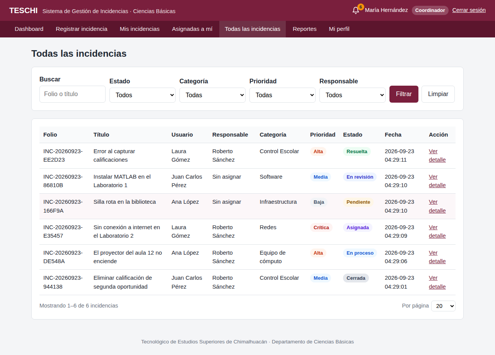

### 9.2 Gestionar una incidencia

En el detalle aparece el recuadro **Gestionar incidencia**. En un solo guardado puedes:

- Cambiar el **estado**.
- **Reclasificar**: corregir la **categoría** y la **prioridad** (queda en el seguimiento).
- Asignar o cambiar el **responsable**. Si la incidencia estaba *Pendiente* o *En revisión*, pasa sola a **Asignada**.
- Agregar un **comentario** y **evidencias**.

Quien reportó y el responsable reciben **una sola notificación** con todos los cambios.

## 10. Reportes

*(Coordinador y Administrador)* Menú **Reportes**.

- **Filtros**: rango de fechas, categoría, prioridad y periodos rápidos (este mes, últimos 3 meses, este año).
- **Indicadores**: registradas, abiertas, atendidas (%), canceladas, abiertas sin responsable, abiertas con más de
  7 días, tiempo promedio para asignar y tiempo promedio de resolución.
- **Gráficas**: por estado, prioridad, categoría, ubicación, **carrera** y por mes.
- **Tablas**: desempeño por responsable y abiertas más antiguas.
- **Exportar a Excel (CSV)** e **Imprimir / Guardar PDF**.

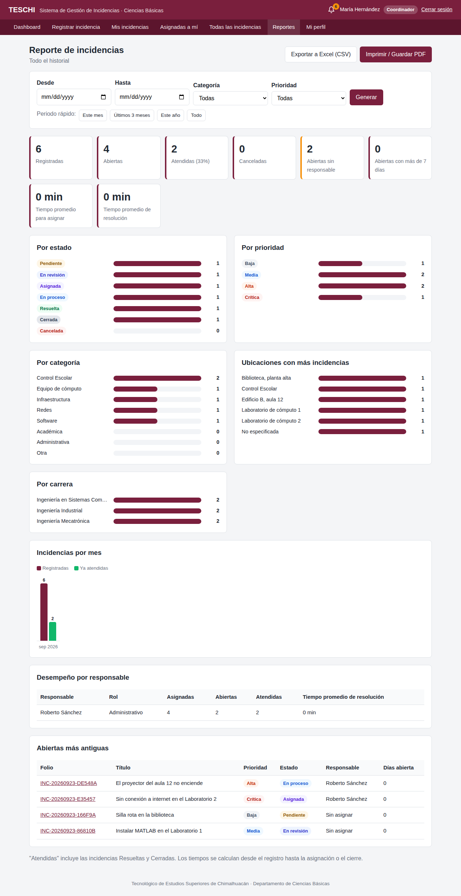

## 11. Notificaciones

La campana muestra cuántos avisos tienes sin leer y se actualiza sola cada minuto.

| Evento | Quién recibe el aviso |
|---|---|
| Nueva incidencia | Coordinadores y Administradores |
| Te asignan (o te quitan) una incidencia | El responsable nuevo (y el anterior) |
| Cambio de estado, categoría o prioridad | Quien reportó y el responsable |
| Pasa a *Resuelta* o *Cancelada* | Además, Coordinadores y Administradores |
| Comentario o evidencia | Quien reportó y el responsable (si comenta quien reportó y aún no hay responsable, también Coordinadores y Administradores) |
| Solicitud de restablecer contraseña | Administradores |

Nadie recibe avisos de sus propias acciones. En la página **Notificaciones** puedes filtrarlas (Todas / Sin leer),
marcarlas como leídas y eliminar las ya leídas.

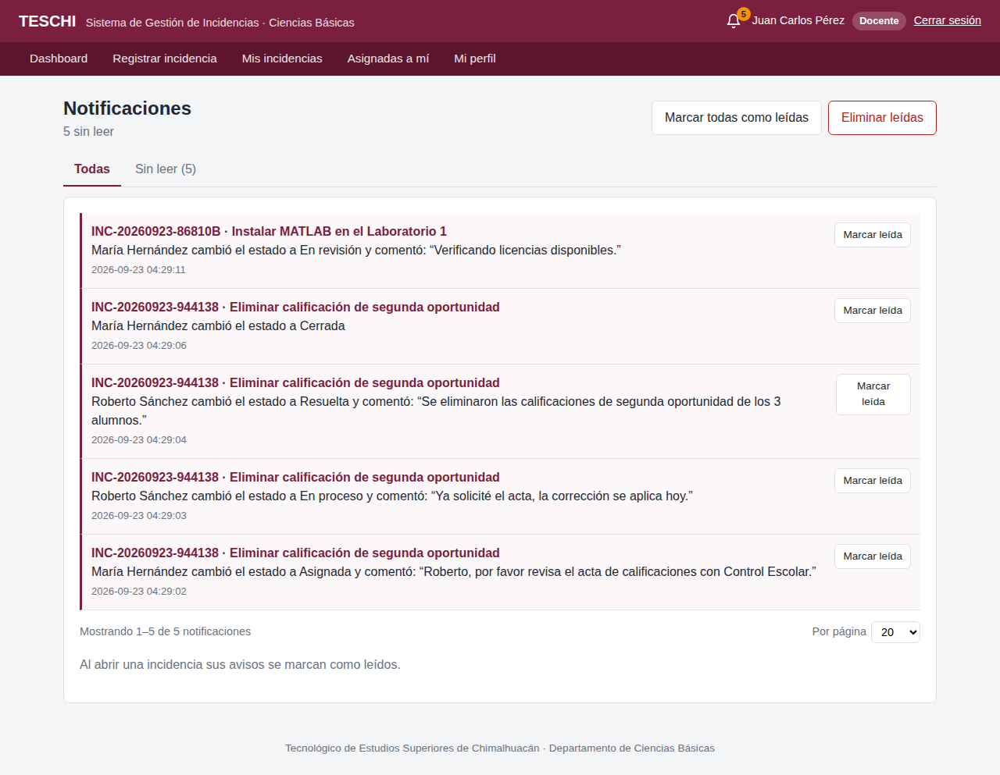

## 12. Mi perfil

Consulta tus datos, actualiza tu **carrera** y **teléfono** (aparecen en el ticket) y cambia tu **contraseña**
(debes escribir la actual). Si tu nombre, correo o matrícula son incorrectos, solicita el cambio al Administrador.

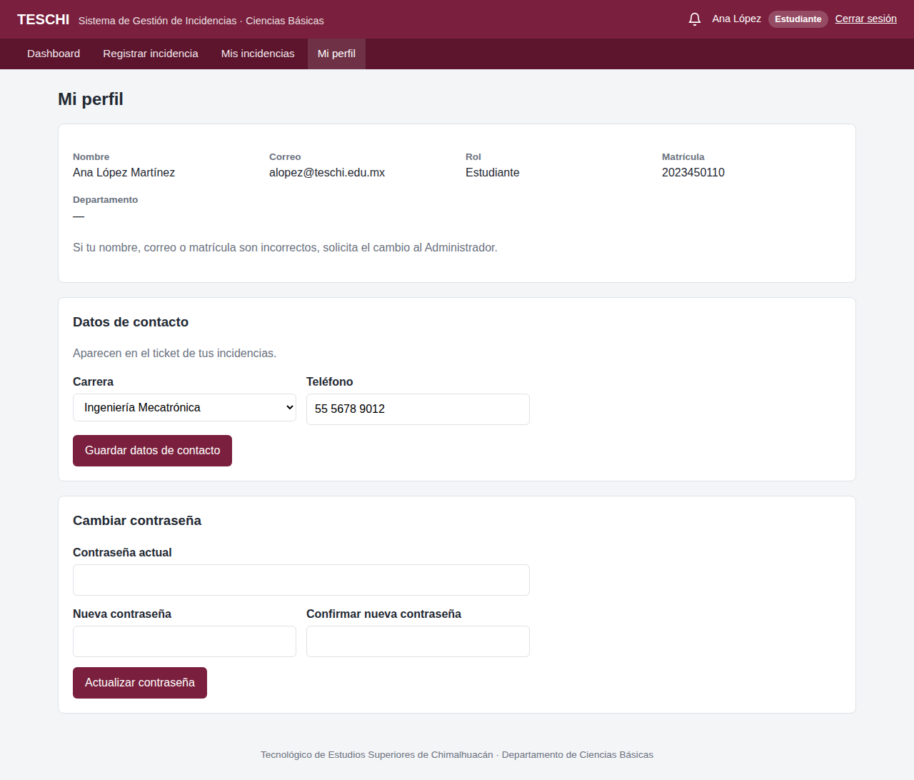

## 13. Administración de usuarios

*(Administrador)* Menú **Usuarios**.

- **Buscar** por nombre, correo o matrícula y filtrar por rol o estado.
- **Nuevo usuario / Editar**: nombre, apellidos, matrícula o No. de empleado, correo, teléfono, rol, departamento,
  carrera y contraseña. El correo y la matrícula no se pueden repetir.
- **Desactivar / Activar**: los usuarios no se eliminan (tienen incidencias relacionadas); uno desactivado ya no puede
  iniciar sesión. No puedes desactivarte ni quitarte el rol de Administrador a ti mismo.

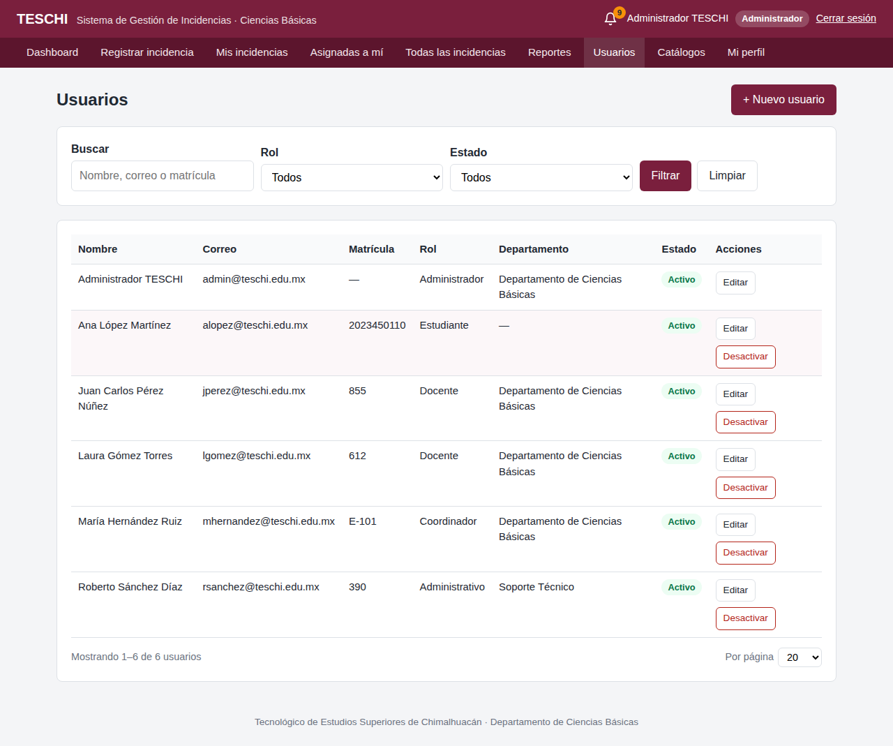

### Restablecer la contraseña de un usuario

En **Editar usuario**, la sección **Restablecer contraseña** indica si el usuario lo solicitó. Pulsa
**Generar enlace**, copia el enlace con **Copiar** y entrégaselo al usuario (es válido 24 horas y una sola vez).
Si el correo está configurado, también puedes usar **Enviar enlace por correo**. Tú nunca conoces la nueva contraseña.

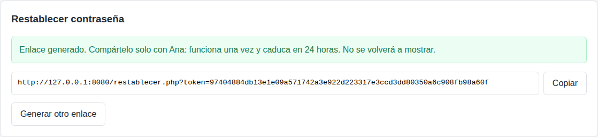

## 14. Catálogos

*(Administrador)* Menú **Catálogos**, con dos pestañas:

- **Categorías**: nombre y descripción.
- **Prioridades**: nombre, **nivel** (mayor = más urgente) y **tiempo estimado de atención** en días hábiles.

Lo que ya usan incidencias no se puede eliminar; se **desactiva** y deja de aparecer al registrar incidencias nuevas.
Siempre debe quedar al menos un elemento activo. Los estados y roles no se editan porque el flujo y los permisos dependen
de ellos.

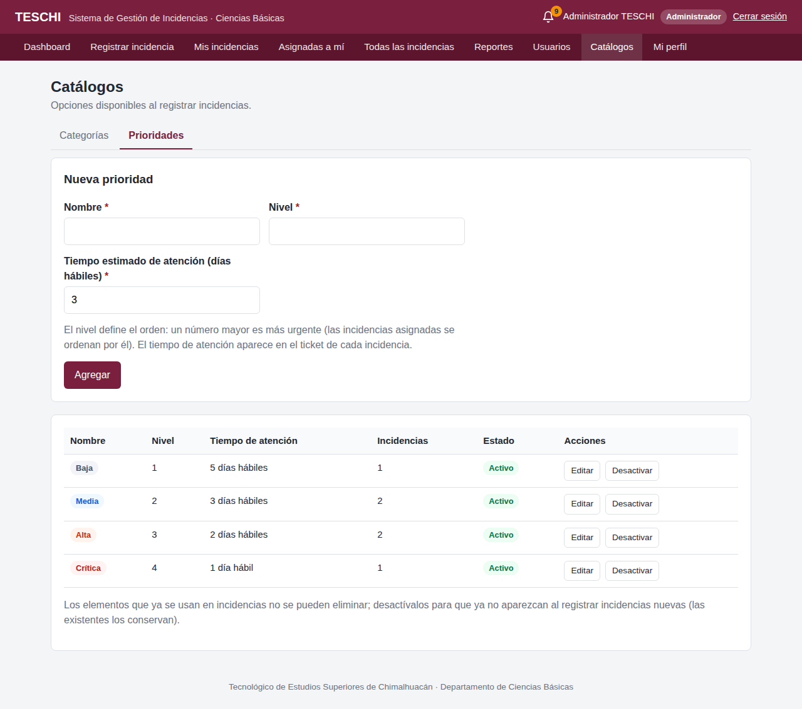

## 15. Estados de una incidencia

| Estado | Significado | Quién lo asigna |
|---|---|---|
| **Pendiente** | Recién registrada | Automático al registrar |
| **En revisión** | El Departamento la está analizando | Coordinador / Administrador |
| **Asignada** | Tiene responsable | Automático al asignar responsable, o Coordinador |
| **En proceso** | El responsable la está atendiendo | Responsable o Coordinador |
| **Resuelta** | Se aplicó la solución (queda fecha de cierre) | Responsable o Coordinador |
| **Cerrada** | El Departamento la dio por terminada; ya no admite comentarios | Coordinador / Administrador |
| **Cancelada** | Ya no procede; ya no admite comentarios | Quien la reportó (si estaba *Pendiente*) o Coordinador |

Una incidencia *Cerrada* o *Cancelada* puede **reabrirse** por un Coordinador o Administrador.

## Uso en celular

Todas las pantallas se adaptan al celular: el menú se acomoda en varias líneas y las tablas se desplazan de lado.

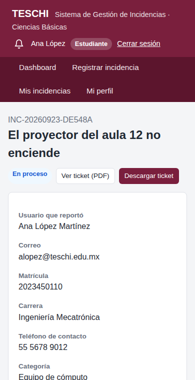
