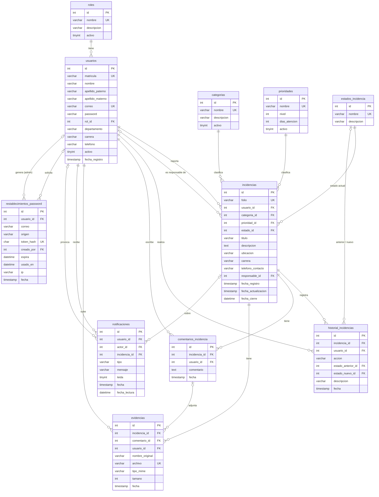

# Base de datos

Base **`sistema_incidencias`** · MariaDB/MySQL · motor InnoDB · juego de caracteres `utf8mb4_unicode_ci`.

## 1. Diagrama entidad-relación

> GitHub dibuja este diagrama automáticamente. En otros visores puedes pegarlo en <https://mermaid.live>.

## 2. Diccionario de datos

Abreviaturas: **PK** llave primaria · **FK** llave foránea · **UK** valor único · **NN** obligatorio.

### 2.1 `roles` — Tipos de usuario

| Columna | Tipo | Restricciones | Descripción |
|---|---|---|---|
| id | int(11) | PK, autoincremental | Identificador |
| nombre | varchar(50) | NN, UK | Administrador, Coordinador, Docente, Administrativo, Estudiante |
| descripcion | varchar(255) | | Descripción del rol |
| activo | tinyint(1) | predeterminado 1 | 1 = activo |

### 2.2 `usuarios` — Cuentas de acceso

| Columna | Tipo | Restricciones | Descripción |
|---|---|---|---|
| id | int(11) | PK, autoincremental | Identificador |
| matricula | varchar(30) | UK | Matrícula (estudiantes) o No. de empleado |
| nombre | varchar(100) | NN | Nombre(s) |
| apellido_paterno | varchar(100) | | Apellido paterno |
| apellido_materno | varchar(100) | | Apellido materno |
| correo | varchar(150) | NN, UK | Correo con el que inicia sesión |
| password | varchar(255) | NN | Hash bcrypt (`password_hash`); nunca en texto plano |
| rol_id | int(11) | NN, FK → roles | Rol del usuario |
| departamento | varchar(150) | | Departamento de adscripción |
| carrera | varchar(150) | | Carrera (lista oficial) |
| telefono | varchar(20) | | Teléfono de contacto |
| activo | tinyint(1) | predeterminado 1 | 0 = no puede iniciar sesión |
| fecha_registro | timestamp | predeterminado ahora | Alta de la cuenta |

### 2.3 `categorias` — Catálogo de categorías

| Columna | Tipo | Restricciones | Descripción |
|---|---|---|---|
| id | int(11) | PK, autoincremental | Identificador |
| nombre | varchar(100) | NN, UK | Nombre de la categoría |
| descripcion | varchar(255) | | Descripción |
| activo | tinyint(1) | predeterminado 1 | 0 = no se ofrece al registrar |

### 2.4 `prioridades` — Catálogo de prioridades

| Columna | Tipo | Restricciones | Descripción |
|---|---|---|---|
| id | int(11) | PK, autoincremental | Identificador |
| nombre | varchar(50) | NN, UK | Baja, Media, Alta, Crítica… |
| nivel | int(11) | NN | Orden de urgencia (mayor = más urgente) |
| dias_atencion | int(11) | NN, predeterminado 3 | Tiempo estimado de atención en días hábiles |
| activo | tinyint(1) | NN, predeterminado 1 | 0 = no se ofrece al registrar |

### 2.5 `estados_incidencia` — Catálogo de estados

| Columna | Tipo | Restricciones | Descripción |
|---|---|---|---|
| id | int(11) | PK, autoincremental | Identificador |
| nombre | varchar(50) | NN, UK | Pendiente, En revisión, Asignada, En proceso, Resuelta, Cerrada, Cancelada |
| descripcion | varchar(255) | | Descripción |

### 2.6 `incidencias` — Reportes registrados

| Columna | Tipo | Restricciones | Descripción |
|---|---|---|---|
| id | int(11) | PK, autoincremental | Identificador; es el **No. de ticket** |
| folio | varchar(30) | NN, UK | `INC-AAAAMMDD-XXXXXX` (fecha + 6 caracteres aleatorios) |
| usuario_id | int(11) | NN, FK → usuarios | Quien la reportó |
| categoria_id | int(11) | NN, FK → categorias | Categoría |
| prioridad_id | int(11) | NN, FK → prioridades | Prioridad |
| estado_id | int(11) | NN, FK → estados_incidencia | Estado actual |
| titulo | varchar(200) | NN | Solicitud (resumen) |
| descripcion | text | NN | Descripción detallada |
| ubicacion | varchar(200) | | Lugar |
| carrera | varchar(150) | | Carrera capturada al registrar (para el ticket) |
| telefono_contacto | varchar(20) | | Teléfono capturado al registrar (para el ticket) |
| responsable_id | int(11) | FK → usuarios | Quien la atiende; NULL = sin asignar |
| fecha_registro | timestamp | NN, predeterminado ahora | Alta |
| fecha_actualizacion | timestamp | NN, se actualiza sola | Último cambio o comentario |
| fecha_cierre | datetime | | Se llena al pasar a Resuelta, Cerrada o Cancelada; se limpia si se reabre |

### 2.7 `historial_incidencias` — Bitácora de cambios

| Columna | Tipo | Restricciones | Descripción |
|---|---|---|---|
| id | int(11) | PK, autoincremental | Identificador |
| incidencia_id | int(11) | NN, FK → incidencias (en cascada) | Incidencia |
| usuario_id | int(11) | NN, FK → usuarios | Quién hizo el cambio |
| accion | varchar(30) | NN | `registro`, `estado`, `asignacion`, `clasificacion`, `evidencia` |
| estado_anterior_id | int(11) | FK → estados_incidencia | Estado antes del cambio |
| estado_nuevo_id | int(11) | FK → estados_incidencia | Estado después del cambio |
| descripcion | varchar(255) | NN | Texto legible, p. ej. "Estado: Asignada → En proceso" |
| fecha | timestamp | NN, predeterminado ahora | Momento del cambio |

### 2.8 `comentarios_incidencia` — Comentarios

| Columna | Tipo | Restricciones | Descripción |
|---|---|---|---|
| id | int(11) | PK, autoincremental | Identificador |
| incidencia_id | int(11) | NN, FK → incidencias (en cascada) | Incidencia |
| usuario_id | int(11) | NN, FK → usuarios | Autor |
| comentario | text | NN | Texto (vacío si el comentario solo lleva archivos) |
| fecha | timestamp | NN, predeterminado ahora | Fecha |

### 2.9 `evidencias` — Archivos adjuntos

| Columna | Tipo | Restricciones | Descripción |
|---|---|---|---|
| id | int(11) | PK, autoincremental | Identificador |
| incidencia_id | int(11) | NN, FK → incidencias (en cascada) | Incidencia |
| comentario_id | int(11) | FK → comentarios_incidencia (en cascada) | NULL = adjuntada al registrar |
| usuario_id | int(11) | NN, FK → usuarios | Quién lo subió |
| nombre_original | varchar(255) | NN | Nombre del archivo del usuario (solo para mostrar) |
| archivo | varchar(100) | NN, UK | Nombre aleatorio en `storage/evidencias/` |
| tipo_mime | varchar(100) | NN | `image/jpeg`, `image/png`, `image/webp` o `application/pdf` |
| tamano | int(11) | NN | Tamaño en bytes |
| fecha | timestamp | NN, predeterminado ahora | Fecha |

### 2.10 `notificaciones` — Avisos dentro del sistema

| Columna | Tipo | Restricciones | Descripción |
|---|---|---|---|
| id | int(11) | PK, autoincremental | Identificador |
| usuario_id | int(11) | NN, FK → usuarios (en cascada) | Destinatario |
| actor_id | int(11) | FK → usuarios (se vuelve NULL) | Quién provocó el aviso |
| incidencia_id | int(11) | FK → incidencias (en cascada) | Incidencia relacionada |
| tipo | varchar(30) | NN | `nueva`, `asignacion`, `estado`, `comentario`, `clasificacion`, `actualizacion` (varios cambios), `password` |
| mensaje | varchar(500) | NN | Texto del aviso |
| leida | tinyint(1) | NN, predeterminado 0 | 1 = leída |
| fecha | timestamp | NN, predeterminado ahora | Fecha |
| fecha_lectura | datetime | | Cuándo se leyó |

### 2.11 `restablecimientos_password` — Solicitudes y enlaces de contraseña

| Columna | Tipo | Restricciones | Descripción |
|---|---|---|---|
| id | int(11) | PK, autoincremental | Identificador |
| usuario_id | int(11) | FK → usuarios (en cascada) | NULL si el correo solicitado no existe |
| correo | varchar(150) | NN | Correo escrito en la solicitud |
| origen | varchar(20) | NN | `solicitud`, `correo` o `administrador` |
| token_hash | char(64) | UK | SHA-256 del token del enlace; NULL en solicitudes |
| creado_por | int(11) | FK → usuarios (se vuelve NULL) | Administrador que generó el enlace |
| expira | datetime | | Caducidad del enlace |
| usado_en | datetime | | Cuándo se usó o se anuló |
| ip | varchar(45) | | IP de la solicitud (límite por hora) |
| fecha | timestamp | NN, predeterminado ahora | Fecha |

## 3. Reglas de integridad

- **Borrado en cascada**: al eliminar una incidencia se eliminan su historial, comentarios, evidencias y
  notificaciones. (El sistema no elimina incidencias ni usuarios; los usuarios se desactivan).
- **Restricción**: no se puede eliminar un usuario, rol, categoría, prioridad o estado que esté en uso.
  El módulo Catálogos solo permite eliminar elementos sin incidencias.
- **Valores únicos**: folio, correo, matrícula, nombres de catálogos, nombre de archivo de evidencia y hash de token.

## 4. Datos iniciales

| Tabla | Registros |
|---|---|
| roles | Administrador, Coordinador, Docente, Administrativo, Estudiante |
| estados_incidencia | Pendiente, En revisión, Asignada, En proceso, Resuelta, Cerrada, Cancelada |
| prioridades | Baja (5 días), Media (3 días), Alta (2 días), Crítica (1 día) |
| categorias | Académica, Administrativa, Infraestructura, Equipo de cómputo, Software, Redes, Control Escolar, Otra |
| usuarios | Administrador (`admin@teschi.edu.mx`) |
