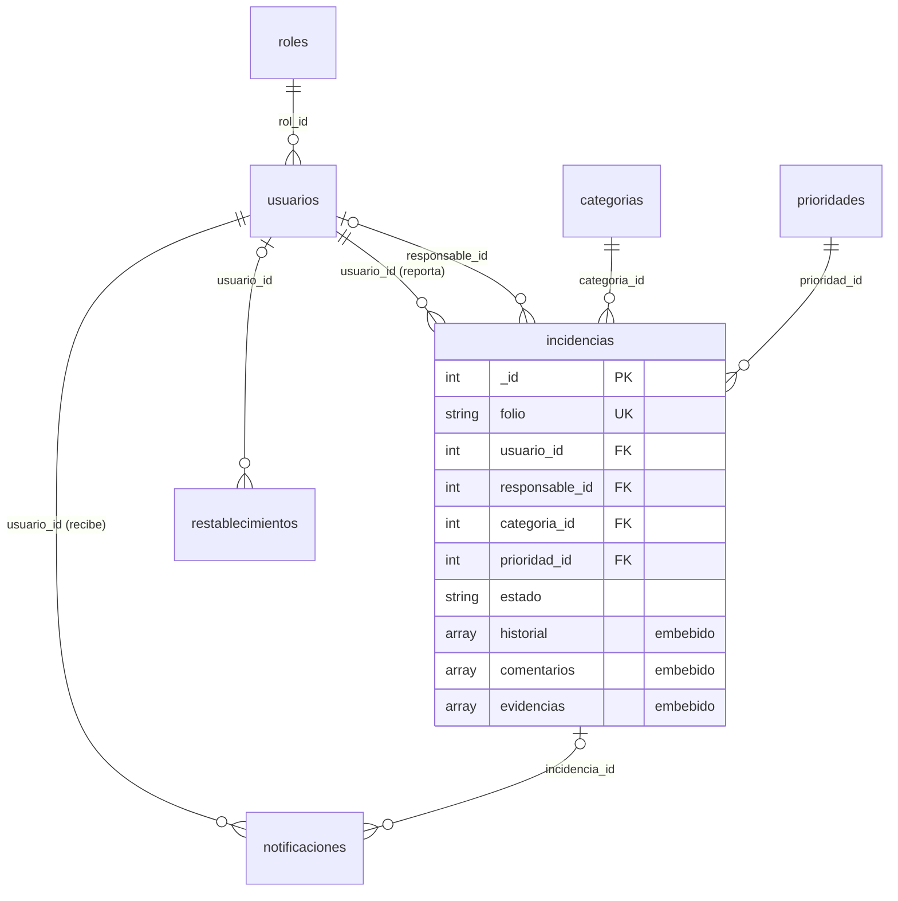

# Base de datos

Base **`sistema_incidencias`** · **MongoDB** (base de datos de documentos, NoSQL).

A diferencia de una base relacional, MongoDB no usa tablas ni filas sino **colecciones** de
**documentos** (parecidos a objetos JSON). No hay `JOIN`: cuando dos datos siempre se leen juntos se
**embeben** en el mismo documento; cuando no, se guarda una **referencia** por id (igual que una llave
foránea) y el sistema resuelve el nombre al leer.

## 1. Colecciones y relaciones

```mermaid
erDiagram
    roles ||--o{ usuarios : "rol_id"
    usuarios ||--o{ incidencias : "usuario_id (reporta)"
    usuarios |o--o{ incidencias : "responsable_id"
    categorias ||--o{ incidencias : "categoria_id"
    prioridades ||--o{ incidencias : "prioridad_id"
    usuarios ||--o{ notificaciones : "usuario_id (recibe)"
    incidencias |o--o{ notificaciones : "incidencia_id"
    usuarios |o--o{ restablecimientos : "usuario_id"

    incidencias {
        int _id PK
        string folio UK
        int usuario_id FK
        int responsable_id FK
        int categoria_id FK
        int prioridad_id FK
        string estado
        array historial "embebido"
        array comentarios "embebido"
        array evidencias "embebido"
    }
```

El historial, los comentarios y las evidencias **no** son colecciones aparte: viven dentro de cada
documento de `incidencias`, en arreglos. Así, guardar un cambio (estado + asignación + comentario) es una
sola escritura atómica del documento, sin transacciones entre varias tablas.

Los **estados** son fijos (el flujo depende de sus nombres): existen como colección `estados` para
consulta, pero el código los maneja como una lista constante y en cada incidencia se guarda el **nombre**
del estado directamente en el campo `estado`.

## 2. Identificadores

Cada documento tiene un `_id`. En este sistema se usan **enteros** (1, 2, 3, …) para que los enlaces
(`detalle_incidencia.php?id=5`) y las referencias entre documentos sean simples. La colección
**`contadores`** entrega el siguiente número por colección, de forma atómica (equivale al `AUTO_INCREMENT`
de SQL). Los ids internos del historial, los comentarios y las evidencias también salen de esos contadores.

Las **fechas** se guardan como texto en formato `AAAA-MM-DD HH:MM:SS`, para mostrarlas y compararlas igual
que en la versión anterior.

## 3. Diccionario de datos

### `roles`
| Campo | Tipo | Notas |
|---|---|---|
| `_id` | int | 1 Administrador, 2 Docente |
| `nombre` | string | Único |
| `descripcion` | string | |
| `activo` | bool | |

### `estados` (catálogo fijo de consulta)
| Campo | Tipo | Notas |
|---|---|---|
| `_id` | int | 1 Pendiente, 8 Ticket generado, 2 En revisión … 7 Cancelada |
| `nombre` | string | El nombre es lo que se guarda en `incidencias.estado` |
| `descripcion` | string | |

### `categorias` (tipos de incidencia del sistema de calificaciones)
| Campo | Tipo | Notas |
|---|---|---|
| `_id` | int | |
| `nombre` | string | Único |
| `descripcion` | string \| null | |
| `activo` | bool | Al desactivarla deja de aparecer al registrar |

### `prioridades`
| Campo | Tipo | Notas |
|---|---|---|
| `_id` | int | |
| `nombre` | string | Único |
| `nivel` | int | Mayor = más urgente (ordena "Asignadas a mí") |
| `dias_atencion` | int | Días hábiles; calcula la fecha compromiso del ticket |
| `activo` | bool | |

### `usuarios`
| Campo | Tipo | Notas |
|---|---|---|
| `_id` | int | |
| `matricula` | string \| null | No. de empleado |
| `nombre`, `apellido_paterno`, `apellido_materno` | string | |
| `correo` | string | Único (índice único) |
| `password` | string | Hash `password_hash` (bcrypt); nunca en texto plano |
| `rol_id` | int | Referencia a `roles` |
| `departamento` | string \| null | |
| `carrera` | string | Se propone al registrar incidencias |
| `telefono` | string | |
| `activo` | bool | Un usuario inactivo no puede iniciar sesión |
| `fecha_registro` | string | |

### `incidencias`
| Campo | Tipo | Notas |
|---|---|---|
| `_id` | int | |
| `folio` | string | Único, `INC-AAAAMMDD-XXXXXX` |
| `usuario_id` | int | Quien la reportó (ref. `usuarios`) |
| `responsable_id` | int \| null | Responsable asignado |
| `categoria_id` | int | Ref. `categorias` |
| `prioridad_id` | int | Ref. `prioridades` |
| `estado` | string | Nombre del estado (Pendiente … Cancelada) |
| `titulo`, `descripcion` | string | |
| `ubicacion` | string \| null | Materia y grupo |
| `carrera`, `telefono_contacto` | string \| null | Datos de contacto guardados para el ticket |
| `fecha_registro`, `fecha_actualizacion` | string | |
| `fecha_cierre` | string \| null | Se llena al quedar Resuelta/Cerrada/Cancelada |
| `historial` | array | Eventos: `{id, usuario_id, accion, estado_anterior_id, estado_nuevo_id, descripcion, fecha}` |
| `comentarios` | array | `{id, usuario_id, comentario, fecha}` |
| `evidencias` | array | `{id, comentario_id, usuario_id, nombre_original, archivo, tipo_mime, tamano, fecha}` |

> Las evidencias guardan solo los **metadatos**; el archivo real vive en `storage/evidencias/` con un
> nombre aleatorio y se descarga por `public/evidencia.php`, que revisa permisos.

### `notificaciones`
| Campo | Tipo | Notas |
|---|---|---|
| `_id` | int | |
| `usuario_id` | int | Quien la recibe |
| `actor_id` | int \| null | Quien la provocó |
| `incidencia_id` | int \| null | Incidencia relacionada |
| `tipo` | string | estado, asignacion, comentario, clasificacion, nueva, actualizacion, password |
| `mensaje` | string | Máx. 500 caracteres |
| `leida` | bool | |
| `fecha`, `fecha_lectura` | string \| null | |

### `restablecimientos`
| Campo | Tipo | Notas |
|---|---|---|
| `_id` | int | |
| `usuario_id` | int \| null | |
| `correo` | string | |
| `origen` | string | `solicitud`, `correo` o `administrador` |
| `token_hash` | string \| null | Hash SHA-256 del token (el token solo viaja en el enlace) |
| `creado_por` | int \| null | Administrador que generó el enlace |
| `ip` | string \| null | Para el límite por IP |
| `fecha`, `expira`, `usado_en` | string \| null | Cada enlace sirve una vez y caduca |

### `contadores`
| Campo | Tipo | Notas |
|---|---|---|
| `_id` | string | Nombre de la colección o del arreglo (`usuarios`, `incidencias`, `historial`, …) |
| `seq` | int | Último id entregado |

## 4. Índices

Los crea `database/seed_mongo.php`:

- `usuarios.correo` — único.
- `incidencias.folio` — único; además `usuario_id`, `responsable_id`, `estado`, `fecha_registro` y
  `evidencias.id` para las búsquedas y listados.
- `notificaciones` — `{usuario_id, leida}` e `incidencia_id`.
- `restablecimientos.token_hash`.
- `categorias.nombre` y `prioridades.nombre` — únicos.

## 5. Cómo se inicializa

No hay un `.sql` que importar. El script **`database/seed_mongo.php`** crea las colecciones, los índices,
los contadores y los datos iniciales (roles, estados, catálogos, usuarios y unas incidencias de ejemplo).
Ver la [Guía de instalación](01_instalacion.md), sección 2.
