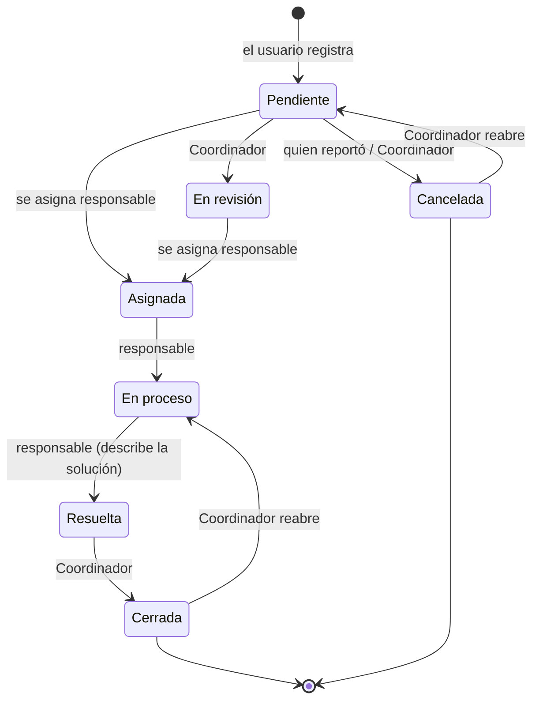

# Arquitectura y seguridad

## 1. Tecnologías

| Capa | Tecnología |
|---|---|
| Servidor | Apache (XAMPP) |
| Lenguaje | PHP 8 (sin frameworks), acceso a datos con **PDO** y consultas preparadas |
| Base de datos | MariaDB / MySQL (InnoDB, `utf8mb4`) |
| Interfaz | HTML5, CSS propio (sin frameworks), JavaScript sin librerías |
| PDF | FPDF 1.9 (incluida en `app/lib/fpdf`) |
| Correo (opcional) | Cliente SMTP propio con STARTTLS/SSL (`app/helpers/correo.php`) |

## 2. Estructura del proyecto

```
sistema-incidencias/
├── app/
│   ├── config/        database.php · institucion.php · correo.php
│   ├── controllers/   AuthController.php (inicio de sesión)
│   ├── helpers/       auth · evidencias · correo · paginacion · carreras · ticket_pdf
│   ├── lib/fpdf/      Librería para generar PDF
│   ├── models/        Usuario · Incidencia · Notificacion · Reporte ·
│   │                  Catalogo · Evidencia · Restablecimiento
│   └── views/         layouts (encabezado y pie) · auth (login y recuperación)
├── database/
│   ├── database.sql   Instalación completa
│   └── migraciones/   Cambios para bases ya instaladas
├── docs/              Esta documentación
├── public/            Páginas que abre el navegador (única carpeta pública)
│   ├── css/ · js/ · img/
│   └── *.php
└── storage/
    └── evidencias/    Archivos subidos (sin acceso directo)
```

### Organización del código

Cada página de `public/` sigue el mismo esquema:

1. Carga `app/helpers/auth.php` y verifica sesión y rol (`requerirSesion()` / `requerirRol()`).
2. Si es un envío de formulario (POST): valida el token CSRF y los datos, llama al **modelo**, guarda un mensaje
   *flash* y **redirige** (patrón Post/Redirect/Get, para que recargar la página no repita la acción).
3. Consulta los datos con los **modelos** y dibuja la vista con el encabezado y pie comunes.

Los **modelos** (`app/models/`) concentran las consultas SQL y las reglas de negocio: por ejemplo,
`Incidencia::cambiarEstado()` actualiza el estado, maneja la fecha de cierre, escribe el historial y prepara las
notificaciones.

## 3. Módulos

| Módulo | Páginas | Modelo / helper |
|---|---|---|
| Autenticación | `login.php`, `logout.php`, `recuperar.php`, `restablecer.php` | `AuthController`, `Restablecimiento`, `correo.php` |
| Incidencias | `incidencias.php`, `mis_incidencias.php`, `detalle_incidencia.php`, `asignadas.php`, `todas_incidencias.php` | `Incidencia` |
| Evidencias | `evidencia.php` (descarga protegida) | `Evidencia`, `evidencias.php` |
| Ticket | `ticket.php` | `ticket_pdf.php` (FPDF) |
| Notificaciones | `notificaciones.php`, `notificaciones_contador.php` (JSON) | `Notificacion` |
| Reportes | `reportes.php`, `reportes_exportar.php` (CSV) | `Reporte` |
| Usuarios | `usuarios.php`, `usuario_form.php`, `perfil.php` | `Usuario` |
| Catálogos | `catalogos.php` | `Catalogo` |

## 4. Flujo de estados



- Al pasar a **Resuelta**, **Cerrada** o **Cancelada** se guarda la `fecha_cierre` (solo la primera vez).
  Si se reabre, se limpia.
- El Coordinador y el Administrador pueden elegir cualquier estado; el responsable solo *En proceso* y *Resuelta*.
- Cada cambio queda en `historial_incidencias` y genera notificaciones.

## 5. Permisos por rol

| Acción | Administrador | Coordinador | Docente / Administrativo | Estudiante |
|---|:-:|:-:|:-:|:-:|
| Registrar incidencias y ver las propias | ✔ | ✔ | ✔ | ✔ |
| Comentar, adjuntar evidencias, descargar ticket | ✔ | ✔ | ✔ (propias y asignadas) | ✔ (propias) |
| Cancelar la propia incidencia *Pendiente* | ✔ | ✔ | ✔ | ✔ |
| Atender incidencias asignadas | ✔ | ✔ | ✔ | — |
| Ver todas las incidencias, asignar, cambiar estado, reclasificar | ✔ | ✔ | — | — |
| Reportes y exportación | ✔ | ✔ | — | — |
| Usuarios, catálogos, restablecer contraseñas | ✔ | — | — | — |

Los permisos se validan **en el servidor** en cada página y en cada acción; ocultar un botón no es la única protección.

## 6. Medidas de seguridad

| Riesgo | Medida |
|---|---|
| Inyección SQL | Toda consulta que recibe datos del usuario usa sentencias preparadas de PDO; los valores de paginación (`LIMIT`/`OFFSET`) se convierten a entero y los nombres de tabla dinámicos se validan contra una lista permitida. |
| XSS (código en textos) | Todo dato mostrado pasa por `e()` (`htmlspecialchars`). |
| CSRF (formularios falsos desde otro sitio) | Cada formulario lleva un token aleatorio por sesión que se verifica con `hash_equals`. |
| Contraseñas | Guardadas con `password_hash` (bcrypt); mínimo 8 caracteres. |
| Fijación de sesión | `session_regenerate_id()` al iniciar sesión y al restablecer contraseña. |
| Usuarios desactivados o con rol cambiado | La sesión se revalida contra la base de datos en cada página. |
| Enumeración de cuentas | El login y la recuperación responden igual exista o no el correo. |
| Enlaces de restablecimiento | Token de 32 bytes aleatorios; solo se guarda su SHA-256; un solo uso (marcado atómico); caducidad; límite de solicitudes por correo e IP; `Referrer-Policy: no-referrer`; el dominio del enlace por correo viene de la configuración, no de la petición. |
| Archivos subidos | Tipo detectado por el contenido (`fileinfo`), no por la extensión; solo JPG/PNG/WEBP/PDF; máximo 5 × 5 MB; nombre aleatorio; guardados fuera de `public/` con `.htaccess` `Require all denied`; se descargan con `evidencia.php`, que revisa permisos y envía `X-Content-Type-Options: nosniff`. |
| Acceso a incidencias ajenas | Detalle, evidencias y ticket solo para quien reportó, el responsable y los gestores (responden "no encontrado" a los demás). |
| Inyección de fórmulas en Excel | El CSV antepone `'` a los valores que empiezan con `=`, `+`, `-` o `@`. |
| Errores técnicos | Los errores de base de datos que el sistema captura se escriben en el log de Apache y el usuario ve un mensaje genérico (ver recomendaciones para errores no previstos). |
| Credenciales | La contraseña del correo va en `correo.local.php`, excluido de Git; el volcado SQL está protegido con `.htaccess`. |
| Transacciones | Cada acción (registrar, gestionar, comentar con archivos) se guarda completa o no se guarda; si falla, se borran los archivos ya subidos. |

### Recomendaciones para producción

Si el sistema se publica en un servidor (no solo en una computadora local):

1. En `php.ini` cambia `display_errors = Off` y `log_errors = On` (XAMPP trae `display_errors = On`,
   útil para desarrollar pero muestra detalles técnicos si ocurre un error no previsto).
2. Usa **HTTPS** para que contraseñas y sesiones viajen cifradas.
3. Asigna contraseña al usuario `root` de MySQL (o crea un usuario solo para esta base) y actualiza
   `app/config/database.php`.
4. Cambia la contraseña inicial del Administrador.
5. Programa respaldos de la base de datos y de `storage/evidencias/`.

## 7. Notificaciones

Cada acción del modelo `Incidencia` **acumula** avisos y, al final del guardado, `enviarAvisos()` crea
**una notificación por persona** combinando las frases, por ejemplo:

> *Luis Pérez te asignó esta incidencia, cambió el estado a Asignada y comentó: "Revísalo hoy"*

Nadie recibe avisos de sus propias acciones. La campana consulta `notificaciones_contador.php` cada 60 segundos.

## 8. Historial de desarrollo

| Paso | Contenido |
|---|---|
| Base | Login, dashboard, registro y consulta de incidencias (proyecto original) |
| 1 | Diseño común, helper de sesión/roles, CSRF, corrección de errores, filtros |
| 2 | Usuarios y perfil |
| 3 | Seguimiento: responsables, historial y comentarios |
| 4 | Notificaciones |
| 5 | Reportes |
| 6 | Catálogos |
| Extras | Evidencias, recuperar contraseña, reclasificar, ticket en PDF, carreras oficiales, paginación |
