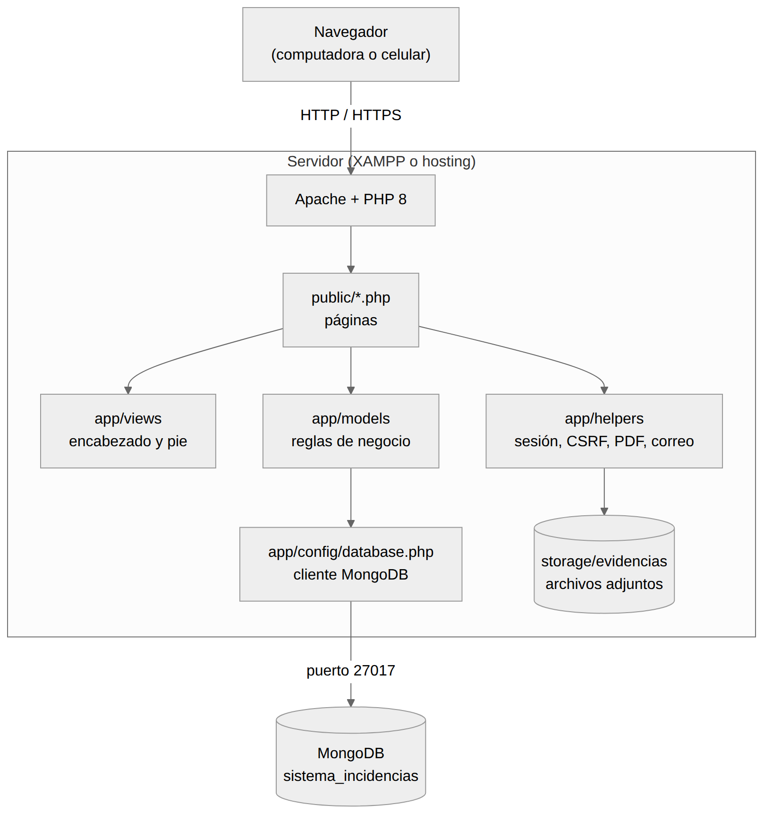
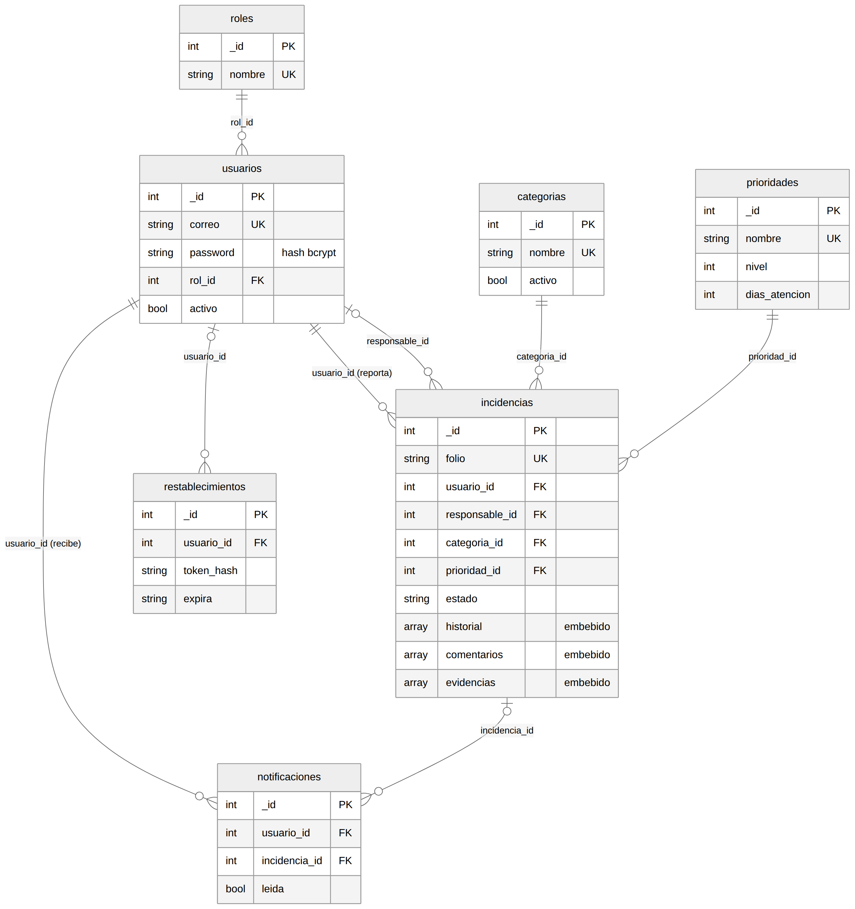
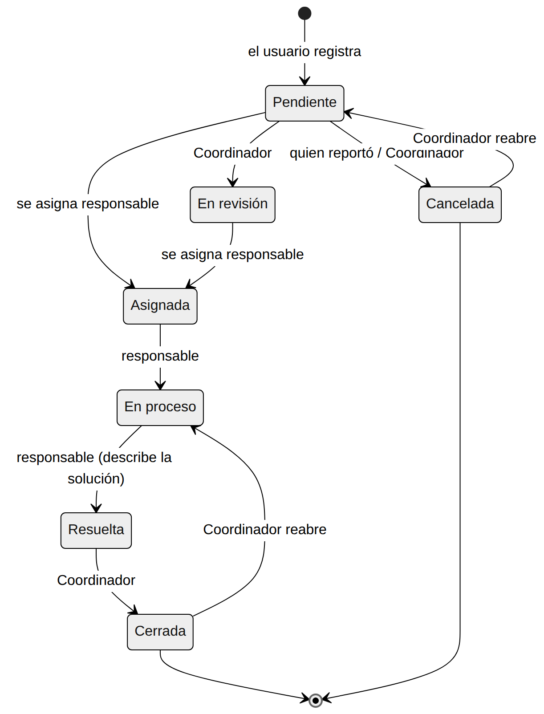

# Manual técnico

Sistema de Gestión de Incidencias · Departamento de Ciencias Básicas · TESCHI

Este manual describe cómo está construido el sistema, para quien lo va a **mantener, desplegar o ampliar**.
Complementa a la [Guía de instalación](01_instalacion.md), la [Guía de despliegue](05_despliegue.md),
la [Base de datos](03_base_de_datos.md) y la [Arquitectura y seguridad](04_arquitectura_y_seguridad.md).

## Contenido

1. [Resumen técnico](#1-resumen-técnico)
2. [Arquitectura](#2-arquitectura)
3. [Estructura del proyecto](#3-estructura-del-proyecto)
4. [Configuración](#4-configuración)
5. [Base de datos MongoDB](#5-base-de-datos-mongodb)
6. [Capa de modelos](#6-capa-de-modelos)
7. [Páginas y rutas](#7-páginas-y-rutas)
8. [Sesión, roles y permisos](#8-sesión-roles-y-permisos)
9. [Flujo de una incidencia](#9-flujo-de-una-incidencia)
10. [Interfaz: estilos y componentes](#10-interfaz-estilos-y-componentes)
11. [Ticket en PDF](#11-ticket-en-pdf)
12. [Evidencias (archivos adjuntos)](#12-evidencias-archivos-adjuntos)
13. [Correo y recuperación de contraseña](#13-correo-y-recuperación-de-contraseña)
14. [Seguridad](#14-seguridad)
15. [Cómo ampliar el sistema](#15-cómo-ampliar-el-sistema)
16. [Operación y mantenimiento](#16-operación-y-mantenimiento)
17. [Pruebas](#17-pruebas)
18. [Solución de problemas técnicos](#18-solución-de-problemas-técnicos)
19. [Limitaciones conocidas](#19-limitaciones-conocidas)

---

## 1. Resumen técnico

| Elemento | Detalle |
|---|---|
| Lenguaje | PHP 8.1 o superior, **sin frameworks**, en páginas por script |
| Servidor web | Apache 2.4 (XAMPP en Windows, o cualquier hosting con PHP) |
| Base de datos | **MongoDB** 5.0+ (local o MongoDB Atlas), por medio de la extensión `mongodb` de PHP |
| Librerías incluidas | `mongodb/mongodb` 2.x (en `vendor/`) y FPDF 1.9 (en `app/lib/fpdf/`); no se necesita Composer |
| Interfaz | HTML5, CSS propio con variables, JavaScript sin librerías (`public/js/app.js`) |
| Sesiones | Sesiones nativas de PHP, con token CSRF y mensajes *flash* |
| Correo | Cliente SMTP propio (STARTTLS/SSL), opcional |
| Archivos | Carpeta `storage/evidencias/`, fuera de la parte pública |

**Por qué MongoDB:** el historial, los comentarios y las evidencias de una incidencia se guardan **dentro del mismo
documento**, así que cada acción es una escritura atómica y las consultas de detalle no necesitan uniones.
El cambio de MySQL a MongoDB fue una especificación del proyecto.

## 2. Arquitectura



Cada petición sigue el mismo recorrido:

1. Apache entrega la página de `public/` que pidió el navegador.
2. La página carga `app/helpers/auth.php`, que inicia la sesión y define las funciones de seguridad.
3. `requerirSesion()` / `requerirRol()` validan que haya sesión y que el rol tenga permiso.
4. Si es un envío de formulario (POST) se valida el token CSRF y los datos, se llama a un **modelo** y se
   **redirige** (patrón *Post/Redirect/Get*: recargar no repite la acción).
5. Si es una consulta (GET) se piden los datos a los modelos y se dibuja la vista con `header.php` y `footer.php`.

Las reglas de negocio viven en los **modelos** (`app/models/`); las páginas solo coordinan y dibujan.

## 3. Estructura del proyecto

```
sistema-incidencias/
├── index.php              Redirige a public/
├── composer.json          Dependencia mongodb/mongodb (ya instalada en vendor/)
├── vendor/                Librería de MongoDB para PHP (incluida)
├── app/                   Código (protegido con .htaccess: no se abre desde el navegador)
│   ├── config/            database.php · institucion.php · correo.php
│   ├── controllers/       AuthController.php (inicio de sesión)
│   ├── helpers/           auth · carreras · correo · evidencias · paginacion · ticket_pdf
│   ├── lib/fpdf/          Librería para generar PDF
│   ├── models/            Usuario · Incidencia · Notificacion · Reporte ·
│   │                      Catalogo · Evidencia · Restablecimiento
│   └── views/             layouts (encabezado y pie) · auth (acceso y recuperación)
├── database/              seed_mongo.php (inicializador; protegido con .htaccess)
├── docs/                  Documentación, manuales, capturas y prototipo
├── public/                Única carpeta accesible desde el navegador
│   ├── *.php              Páginas (una por pantalla o acción)
│   ├── css/style.css      Estilos y colores institucionales
│   ├── js/app.js          Confirmaciones, campana, copiar, impresión
│   └── img/               Logotipos y foto de fondo del acceso
└── storage/evidencias/    Archivos subidos (protegido con .htaccess)
```

> `app/controllers/IncidenciaController.php`, `routes/routes.php` y `app/views/dashboard/index.php` son archivos
> vacíos heredados de la primera versión; no se usan y pueden eliminarse.

## 4. Configuración

### 4.1 Conexión a MongoDB (`app/config/database.php`)

La clase `Database` lee dos valores, primero de variables de entorno y si no existen de un valor por defecto:

| Variable de entorno | Valor por defecto | Uso |
|---|---|---|
| `MONGODB_URI` | `mongodb://127.0.0.1:27017` | Cadena de conexión (local o `mongodb+srv://` de Atlas) |
| `MONGODB_DB` | `sistema_incidencias` | Nombre de la base |

`conectar()` devuelve un objeto `MongoDB\Database` configurado con *typeMap* a arreglos de PHP, así que todas las
consultas devuelven arreglos normales. Si falta la extensión `mongodb` o el servidor no responde, la página muestra un
mensaje claro y el detalle técnico queda en el log de Apache.

Además ofrece dos utilidades:

- `Database::siguienteId($db, "coleccion")`: entero autoincremental (equivale al `AUTO_INCREMENT`), usando
  `findOneAndUpdate` con `$inc` sobre la colección `contadores` (operación atómica).
- `Database::ahora()`: fecha actual en formato `AAAA-MM-DD HH:MM:SS`.

### 4.2 Otros archivos de configuración

| Archivo | Qué configura |
|---|---|
| `app/config/institucion.php` | Nombre, dirección y leyendas del ticket, lista oficial de carreras y rutas de los dos logotipos |
| `app/config/correo.php` | SMTP (desactivado por defecto). Las credenciales reales van en `app/config/correo.local.php`, que no se sube a Git |
| `php.ini` | `extension=mongodb`, `upload_max_filesize`, `post_max_size`, `display_errors` |

## 5. Base de datos MongoDB

Resumen (el detalle está en [Base de datos](03_base_de_datos.md)):



| Colección | Contenido |
|---|---|
| `usuarios` | Cuentas, rol (por `rol_id`), hash de contraseña, carrera, teléfono, estado activo |
| `incidencias` | Incidencia con `historial[]`, `comentarios[]` y `evidencias[]` **embebidos** |
| `notificaciones` | Bandeja de avisos por usuario |
| `restablecimientos` | Enlaces de restablecer contraseña (solo se guarda el hash del token) |
| `roles`, `estados`, `categorias`, `prioridades` | Catálogos |
| `contadores` | Siguiente número de cada colección |

Criterios de diseño:

- **Embeber** lo que siempre se lee junto con la incidencia (historial, comentarios, evidencias).
- **Referenciar por id** lo que cambia por separado (usuarios, categorías, prioridades); el nombre se resuelve al leer.
- El **estado** se guarda como nombre (`"En proceso"`) porque el flujo depende de esos nombres.
- Las **fechas** son texto `AAAA-MM-DD HH:MM:SS`, que se ordena y compara correctamente.
- Los `_id` son **enteros** para que los enlaces (`detalle_incidencia.php?id=5`) sean simples.

### 5.1 Inicializar la base

```
php database/seed_mongo.php          # crea todo si la base está vacía
php database/seed_mongo.php force    # borra y vuelve a crear con datos de ejemplo
```

El script crea colecciones, índices únicos (`usuarios.correo`, `incidencias.folio`, nombres de catálogo), los
contadores y los datos iniciales. Sin `force` **no toca** una base que ya tiene usuarios.

### 5.2 Consultar con herramientas

- **MongoDB Compass** (interfaz gráfica): conectar a `mongodb://localhost:27017` y abrir `sistema_incidencias`.
- **mongosh** (consola): `use sistema_incidencias` y `db.incidencias.find({ estado: "Pendiente" })`.

## 6. Capa de modelos

Cada modelo recibe en su constructor el objeto `MongoDB\Database` y expone métodos que devuelven **arreglos** con
la misma forma que esperan las vistas.

| Modelo | Responsabilidad | Métodos principales |
|---|---|---|
| `Usuario` | Cuentas | `buscarPorCorreo`, `buscarPorId`, `listar`/`contar` (filtros), `crear`, `actualizar`, `cambiarPassword`, `cambiarActivo`, `actualizarContacto`, `existe`, `obtenerRoles` |
| `Incidencia` | Núcleo del sistema | `crear`, `buscarPorId`, `listarTodas`/`contarTodas`, `listarDeUsuario`, `listarAsignadas`, `conteoPorEstado`, `cambiarEstado`, `asignarResponsable`, `reclasificar`, `agregarComentario`, `obtenerSeguimiento`, `avisar`/`enviarAvisos`, `fechaCompromiso` |
| `Notificacion` | Avisos | `crear`, `listar`, `contar`, `contarNoLeidas`, `marcarLeida`, `marcarLeidasDeIncidencia`, `marcarTodasLeidas`, `eliminarLeidas` |
| `Catalogo` | Categorías y prioridades | `listar`, `guardar`, `cambiarActivo`, `eliminar` |
| `Evidencia` | Archivos adjuntos | `validarSubida`, `guardar`, `listarPorIncidencia`, `buscarPorId`, `eliminar`, `deshacer` |
| `Restablecimiento` | Enlaces de contraseña | `crearToken`, `buscarVigente`, `usar`, `anularPendientes`, `limiteExcedido`, `registrarSolicitud`, `solicitudPendiente` |
| `Reporte` | Estadísticas | `resumen`, `porEstado`, `porCategoria`, `porPrioridad`, `porMes`, `porResponsable`, `porCarrera`, `porUbicacion`, `abiertasMasAntiguas`, `listadoDetallado` |

### 6.1 Escrituras atómicas

Como historial, comentarios y evidencias están dentro del documento de la incidencia, cada cambio se hace con un
solo operador de MongoDB sobre ese documento:

| Acción | Operador |
|---|---|
| Nuevo evento de historial o comentario | `$push` a `historial` / `comentarios` |
| Cambiar estado, responsable, categoría o prioridad | `$set` |
| Eliminar una evidencia | `$pull` de `evidencias` |
| Id autoincremental | `$inc` con `findOneAndUpdate` |

Por eso el sistema **no usa transacciones**. Si una acción falla a la mitad (por ejemplo, al guardar un archivo),
`Evidencia::deshacer()` borra los archivos que alcanzaron a copiarse.

### 6.2 Notificaciones sin duplicados

Las acciones de `Incidencia` no crean avisos directamente: los **acumulan** con `avisar()` (por usuario) y, al final
del guardado, `enviarAvisos()` genera **una notificación por persona** que resume todos los cambios. Nadie recibe
avisos de sus propias acciones.

### 6.3 Reportes

`Reporte` carga las incidencias que pasan el filtro (sin comentarios ni evidencias) y calcula los indicadores en
PHP. Con el volumen de un departamento esto es suficiente; si el sistema creciera a cientos de miles de incidencias
convendría migrar esos cálculos a *aggregation pipelines* de MongoDB.

## 7. Páginas y rutas

No hay enrutador: cada pantalla es un archivo de `public/`.

| Página | Quién entra | Función |
|---|---|---|
| `login.php`, `logout.php` | Público / sesión | Iniciar y cerrar sesión |
| `recuperar.php`, `restablecer.php` | Público | Solicitar y usar un enlace de nueva contraseña |
| `dashboard.php` | Todos | Resumen por estado y accesos |
| `incidencias.php` | Todos | Registrar incidencia (con evidencias) |
| `mis_incidencias.php` | Todos | Incidencias propias |
| `asignadas.php` | Administrador, Coordinador, Docente, Administrativo | Incidencias donde soy responsable |
| `todas_incidencias.php` | Administrador, Coordinador | Listado completo con filtros |
| `detalle_incidencia.php` | Dueño, responsable y gestores | Detalle, seguimiento y todas las acciones |
| `ticket.php` | Dueño, responsable y gestores | PDF del ticket |
| `evidencia.php` | Dueño, responsable y gestores | Descarga de un adjunto (con permisos) |
| `notificaciones.php`, `notificaciones_contador.php` | Todos | Bandeja y contador (JSON) de la campana |
| `perfil.php` | Todos | Datos de contacto y cambio de contraseña |
| `reportes.php`, `reportes_exportar.php` | Administrador, Coordinador | Estadísticas y CSV |
| `usuarios.php`, `usuario_form.php` | Administrador | Alta, edición, activar/desactivar y enlace de contraseña |
| `catalogos.php` | Administrador | Categorías y prioridades |

`detalle_incidencia.php` procesa la acción enviada en el campo oculto `accion`: `gestionar`, `atender`, `comentar`,
`eliminar_evidencia` y `cancelar`. Cada una valida permisos y datos antes de tocar el modelo.

## 8. Sesión, roles y permisos

`app/helpers/auth.php` inicia la sesión y define:

| Función | Uso |
|---|---|
| `requerirSesion()` | Exige sesión. **Vuelve a leer al usuario en MongoDB** en cada página: si lo desactivaron o le cambiaron el rol, el cambio aplica de inmediato |
| `requerirRol([...])` | Exige uno de los roles indicados |
| `tieneRol(...)`, `esGestor()` | Consultas de rol (gestor = Administrador o Coordinador) |
| `e($valor)` | Escapa HTML (`htmlspecialchars`); **todo dato mostrado pasa por aquí** |
| `campoCsrf()`, `verificarCsrf()` | Token CSRF por sesión, comparado con `hash_equals` |
| `flash()`, `obtenerFlash()` | Mensajes que sobreviven a la redirección |
| `claseEstado()`, `clasePrioridad()` | Clase CSS de las etiquetas de color |

Matriz de permisos:

| Módulo | Administrador | Coordinador | Docente / Administrativo | Estudiante |
|---|:-:|:-:|:-:|:-:|
| Registrar, ver las propias, comentar, cancelar (Pendiente) | ✔ | ✔ | ✔ | ✔ |
| Asignadas a mí / atender | ✔ | ✔ | ✔ | — |
| Todas las incidencias, asignar, cambiar estado, reclasificar | ✔ | ✔ | — | — |
| Reportes y exportación | ✔ | ✔ | — | — |
| Usuarios y Catálogos | ✔ | — | — | — |

## 9. Flujo de una incidencia



- Al registrarla queda **Pendiente**, con su primer evento de historial y aviso a los gestores.
- Al asignar responsable, una incidencia *Pendiente* o *En revisión* pasa sola a **Asignada**.
- Un responsable que no es gestor solo puede elegir **En proceso** o **Resuelta**; para *Resuelta* debe describir la solución.
- Al llegar a un estado final (*Resuelta*, *Cerrada*, *Cancelada*) se guarda `fecha_cierre` (solo la primera vez);
  si se reabre, se limpia.
- *Cerrada* y *Cancelada* no admiten comentarios. Solo quien la reportó puede cancelarla, y solo si está *Pendiente*.
- La **fecha límite** se calcula en `Incidencia::fechaCompromiso()`: fecha de registro más los días hábiles
  (lunes a viernes) de la prioridad.

## 10. Interfaz: estilos y componentes

Todo el diseño está en `public/css/style.css`, con **variables CSS** en el bloque `:root`. Cambiar una variable cambia
el color en todo el sistema.

| Variable | Valor | Uso |
|---|---|---|
| `--color-primario` | `#007a3d` | Verde TESCHI: títulos, botones, cabecera de tablas |
| `--color-primario-oscuro` | `#005a2d` | Títulos y degradado |
| `--color-acento` | `#43b02a` | Verde limón: sección activa del menú, bordes de tarjeta |
| `--color-cielo` | `#1f7ae0` | Azul: detalles y serie «atendidas» en gráficas |
| `--color-rojo` | `#e30613` | Línea roja del logotipo |
| `--degradado` | verde oscuro → limón | Encabezado y botón principal |

Componentes reutilizables (clases CSS):

| Clase | Descripción |
|---|---|
| `.topbar`, `.menu` | Encabezado con logotipo y menú fijo con la sección activa resaltada |
| `.tarjeta` | Bloque de contenido con borde verde superior y sombra |
| `.resumen-item`, `.grid-resumen` | Indicadores numéricos |
| `.modulo`, `.grid-modulos` | Accesos del Dashboard |
| `.btn`, `.btn-primary`, `.btn-secundario`, `.btn-peligro`, `.btn-sm` | Botones |
| `.tabla`, `.tabla-contenedor` | Tablas con encabezado verde y filas alternadas |
| `.badge` y variantes | Etiquetas de estado y prioridad |
| `.alerta`, `.alerta-exito`, `.alerta-error`, `.alerta-aviso` | Mensajes |
| `.timeline`, `.evento` | Línea de tiempo del seguimiento |
| `.barras`, `.columnas-mes` | Gráficas de Reportes (CSS puro, sin librerías) |
| `.paginacion` | Paginación |
| `.login-container`, `.login-card` | Pantallas de acceso con la foto de fondo |

**Pantallas de acceso:** `app/views/auth/login.php` y `tarjeta_inicio.php`/`tarjeta_fin.php` (recuperar y restablecer)
usan la foto `public/img/fondo_login.jpg` con una capa verde. **Encabezado:** `app/views/layouts/header.php`
(logotipo `logo_teschi_web.png`, campana, menú según el rol). **JavaScript** (`public/js/app.js`): confirmaciones
(`data-confirmar`), contador de la campana cada minuto, botón Imprimir, botón Copiar y envío automático del selector
«por página».

**Diseño responsivo:** las tarjetas se apilan, el menú cambia de línea y las tablas se desplazan de lado en celular.
Al imprimir Reportes (`@media print`) se ocultan el menú y los botones.

## 11. Ticket en PDF

`app/helpers/ticket_pdf.php` define `generarTicketPdf($incidencia, $datos)` sobre la clase `TicketPdf` (extiende FPDF).
Se invoca desde `public/ticket.php`, que primero valida permisos.

- El encabezado lleva tres columnas: logotipo del **Gobierno del Estado de México**, datos de la institución y logotipo
  del **TESCHI** (rutas en `app/config/institucion.php`; si falta un archivo, simplemente no se dibuja).
- El texto se convierte a Windows-1252 (`iconv`) porque FPDF no usa UTF-8; por eso la extensión `iconv`/`mbstring` es requisito.
- Muestra datos del solicitante, solicitud, tiempo de atención con fecha límite, estado, responsable, número de
  evidencias, leyendas y espacios de firma y sello.
- `ticket.php?id=N` abre el PDF en el navegador y `ticket.php?id=N&descargar=1` lo descarga.

## 12. Evidencias (archivos adjuntos)

- Límite: **5 archivos de 5 MB** por envío; tipos **JPG, PNG, WEBP y PDF**.
- El tipo se detecta por el **contenido** (`finfo`), no por la extensión ni por lo que declare el navegador.
- Se guardan en `storage/evidencias/` con **nombre aleatorio** (32 caracteres hexadecimales); el nombre original solo se
  guarda como metadato en el documento.
- `storage/` tiene `.htaccess` con `Require all denied`: los archivos **solo** se entregan por `public/evidencia.php`,
  que comprueba que el usuario sea dueño, responsable o gestor, y envía `X-Content-Type-Options: nosniff`.
- Los metadatos viven en el arreglo `evidencias` de la incidencia (`nombre_original`, `archivo`, `tipo_mime`, `tamano`,
  `comentario_id`, `usuario_id`).
- Al eliminar una evidencia se quita del documento con `$pull` y **después** se borra el archivo.

## 13. Correo y recuperación de contraseña

- **Sin correo configurado** (predeterminado): «¿Olvidaste tu contraseña?» avisa a los Administradores y uno de ellos
  genera un enlace desde *Usuarios → Editar → Generar enlace* (válido 24 horas).
- **Con correo configurado:** el enlace llega directo al usuario (válido 60 minutos).
- Seguridad de los enlaces: token de 32 bytes aleatorios; en la base solo se guarda su **SHA-256**; un solo uso
  (se marca con una actualización condicional atómica); al generar uno nuevo se anulan los anteriores; límite de 3
  solicitudes por correo y 10 por IP cada hora; respuesta idéntica exista o no el correo.
- **Avisos y ticket por correo:** `app/helpers/correo_incidencias.php` envía por SMTP el mismo texto de cada notificación
  (`Incidencia::enviarAvisos()` llama a `correoDeNotificacion()`) y, al registrar una incidencia, el ticket en PDF como
  adjunto (`correoDeTicket()`, llamado desde `public/incidencias.php`). `enviarCorreo()` acepta un arreglo de adjuntos
  (`multipart/mixed`). Son de **mejor esfuerzo**: si falla, se escribe en el log y la acción continúa. Se desactivan con
  `"notificar_por_correo" => false`. Cada envío es síncrono (≈1–2 s por destinatario).
- Para activar el correo: crear `app/config/correo.local.php` con los datos SMTP (por ejemplo Gmail con *contraseña de
  aplicación*) y `url_base` apuntando a `public/`.

## 14. Seguridad

| Riesgo | Medida |
|---|---|
| Inyección en consultas | Consultas de MongoDB armadas con arreglos tipados (los valores viajan como datos BSON); valores convertidos a entero o texto; búsquedas con `Regex` escapada (`preg_quote`) |
| XSS | Todo dato mostrado pasa por `e()` |
| CSRF | Token por sesión en cada formulario, verificado con `hash_equals` |
| Contraseñas | `password_hash` (bcrypt), mínimo 8 caracteres |
| Sesión | `session_regenerate_id()` al iniciar sesión y al restablecer contraseña; el rol se revalida en cada página |
| Enumeración de cuentas | Mismo mensaje en login y recuperación |
| Acceso a incidencias ajenas | Detalle, ticket y evidencias solo para dueño, responsable y gestores |
| Archivos subidos | Tipo por contenido, nombre aleatorio, fuera de la parte pública, descarga con permisos |
| CSV | Se antepone `'` a valores que empiezan con `=`, `+`, `-` o `@` (inyección de fórmulas en Excel) |
| Carpetas internas | `app/`, `database/` y `storage/` con `.htaccess` `Require all denied` |
| Credenciales | `correo.local.php` fuera de Git; la conexión a MongoDB puede venir de `MONGODB_URI` |

**Recomendaciones para producción:** HTTPS; `display_errors = Off` y `log_errors = On`; activar la autenticación de
MongoDB con una URI con usuario y contraseña; no exponer el puerto `27017`; cambiar la contraseña inicial del
Administrador; respaldos periódicos.

## 15. Cómo ampliar el sistema

### 15.1 Agregar una página

1. Crear `public/mi_pagina.php`. Al inicio: `require_once "../app/helpers/auth.php";` y `requerirSesion();`
   (o `requerirRol([...])`).
2. Conectar: `$db = (new Database())->conectar();` (con `require_once "../app/config/database.php";`).
3. Si recibe un formulario: `verificarCsrf()`, validar, llamar al modelo, `flash(...)` y `header("Location: ...")`.
4. Dibujar con `require_once "../app/views/layouts/header.php";` y `footer.php`.
5. Para mostrarla en el menú, agregar una fila al arreglo `$menu` de `app/views/layouts/header.php`.

### 15.2 Agregar un campo a las incidencias

1. Agregarlo en `Incidencia::crear()` y, si se muestra, en `decorarDetalle()` o `decorarLista()`.
2. Pedirlo en `public/incidencias.php` (formulario y validación).
3. Mostrarlo en `detalle_incidencia.php` y, si aplica, en el ticket y el CSV.
4. Como MongoDB no tiene esquema fijo, **no hace falta migrar**: las incidencias anteriores simplemente no traerán el
   campo (usa `?? null` al leerlo).

### 15.3 Agregar un estado

Los estados son fijos porque el flujo depende de sus nombres. Para agregar uno: añadirlo a `Incidencia::ESTADOS`, a la
colección `estados` (`seed_mongo.php`), a `claseEstado()` y al CSS (`.badge-...`), y definir en qué transiciones participa.

### 15.4 Agregar un rol

Insertar el documento en `roles` (con `seed_mongo.php` o con Compass), agregarlo a las listas de permisos
(`requerirRol`, `Incidencia::ROLES_RESPONSABLES`, arreglo `$menu`) y a la matriz de la sección 8.

## 16. Operación y mantenimiento

| Tarea | Cómo |
|---|---|
| Respaldar la base | `mongodump --db sistema_incidencias --out C:\respaldos\incidencias` |
| Restaurar | `mongorestore --db sistema_incidencias C:\respaldos\incidencias\sistema_incidencias` |
| Respaldar evidencias | Copiar la carpeta `storage/evidencias/` |
| Reiniciar datos de ejemplo | `php database/seed_mongo.php force` (**borra todo**) |
| Restablecer la contraseña del Administrador | Generar un hash con `php -r "echo password_hash('NuevaClave', PASSWORD_DEFAULT);"` y actualizarlo con `db.usuarios.updateOne({correo:"admin@teschi.edu.mx"},{$set:{password:"..."}})` en mongosh |
| Ver errores | `C:\xampp\apache\logs\error.log` (XAMPP) o los registros del hosting |
| Actualizar el sistema | Reemplazar archivos **sin borrar** `storage/evidencias/` ni la configuración propia; la base de datos normalmente no cambia |
| Activar Apache y MongoDB al encender el equipo | Instalar Apache como servicio desde el Panel de XAMPP (casilla *Svc*); MongoDB ya se instala como servicio de Windows |

**Usuarios:** no se eliminan (tienen incidencias relacionadas); se **desactivan** y ya no pueden iniciar sesión.
**Catálogos:** lo que ya usan las incidencias no se elimina, solo se desactiva.

## 17. Pruebas

El proyecto no incluye pruebas automáticas. La verificación se hace de forma manual con la lista de la
[Guía de despliegue, Parte C](05_despliegue.md) y con este recorrido mínimo:

1. Iniciar sesión con cada rol y comprobar que el menú cambia.
2. Un estudiante registra una incidencia **con foto**; el coordinador recibe la notificación.
3. El coordinador la asigna; el responsable la pasa a *En proceso* y luego a *Resuelta* con solución.
4. Descargar el **ticket en PDF** (con logotipos y acentos correctos).
5. Revisar **Reportes** y exportar el CSV.
6. Probar la recuperación de contraseña (generar el enlace desde *Usuarios*).
7. Comprobar que `app/config/database.php`, `database/seed_mongo.php` y `storage/evidencias/` responden **403**.

El [prototipo navegable](prototipo/README.md) permite mostrar el flujo completo sin instalar nada.

## 18. Solución de problemas técnicos

| Síntoma | Causa probable | Solución |
|---|---|---|
| «falta la extensión mongodb de PHP» | Extensión no cargada | Copiar `php_mongodb.dll` (DLL compilada, no el código fuente) a `php/ext`, agregar `extension=mongodb` a `php.ini` y reiniciar Apache |
| Apache no inicia tras editar `php.ini` | La DLL no coincide con PHP (versión, *Thread Safe* o 64 bits) | Descargar la DLL que coincida; revisar `error.log` |
| «No se pudo conectar a la base de datos» | Servicio de MongoDB apagado o URI incorrecta | Iniciar *MongoDB Server* en `services.msc`; revisar `MONGODB_URI` |
| El login no reconoce ninguna cuenta | No se ejecutó `seed_mongo.php` | Ejecutarlo (sección 5.1) |
| No aparece la base en Compass | MongoDB crea la base al guardar el primer dato | Ejecutar `seed_mongo.php` y refrescar |
| Página «Not Found» | Carpeta mal nombrada o anidada en `htdocs` | Debe ser `htdocs/sistema-incidencias/` con `app`, `public`, etc. adentro |
| Acentos raros en el ticket | `iconv` o `mbstring` desactivados | Activarlos en `php.ini` |
| No se adjuntan archivos | Límites de PHP | Subir `upload_max_filesize` y `post_max_size` |
| Estilos viejos tras actualizar | Caché del navegador | `Ctrl + F5` |
| Un usuario no puede entrar a una página | Su rol no tiene permiso | Revisar la matriz de la sección 8 |

## 19. Limitaciones conocidas

- Sin pruebas automáticas; la verificación es manual.
- Sin transacciones multi-documento: se evitan embebiendo los datos relacionados en la incidencia. Una operación que
  modifique **varias incidencias a la vez** no sería atómica.
- Los reportes se calculan en PHP; con volúmenes muy grandes convendría usar agregaciones de MongoDB.
- La paginación usa `skip`/`limit`, suficiente para el volumen esperado.
- El envío de correo es opcional y depende de un servidor SMTP externo.
- Las fechas se guardan como texto y en la zona horaria del servidor.
- No hay bitácora de inicios de sesión ni bloqueo por intentos fallidos (solo el límite de solicitudes de recuperación).
